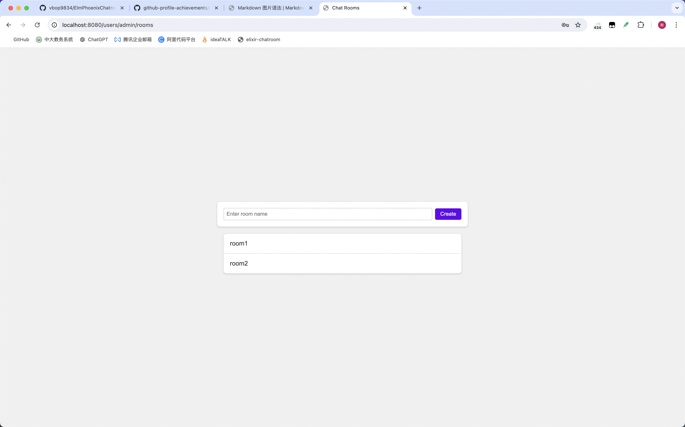
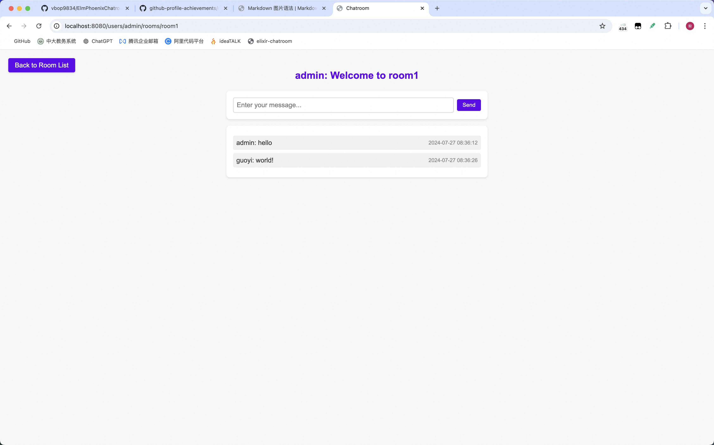

# Elixir-Chatroom

### 简介
一个基于GenServer和Plug的简单聊天室(没有使用Pheonix)。
拥有实时通信功能，且通过mongodb存储聊天记录。
通过:pg实现多节点广播，并设计了Monitor可以动态检测增删节点并调整Ex-Hash-Ring节点配置，从而实现负载均衡。
### 启动方式
```
sh quickstart.sh
```
修改WORK_DIR为你的项目路径即可。
需要动态增删节点调整nginx配置和quickstart.sh脚本。
默认设置的节点数为3，默认节点名为：node1,node2,node3。
默认端口为4001,4002,4003。
### 功能截图
登录页面

聊天室列表页面

聊天室页面


---
### Overview
A simple chatroom based on GenServer and Plug (without using Pheonix).
It has real-time communication function and stores chat records through mongodb.
Broadcasting among multiple nodes is implemented by :pg, and a Monitor is designed to dynamically detect the addition and deletion of nodes and adjust the Ex-Hash-Ring node configuration to achieve load balancing.
### How to start
```
sh quickstart.sh
```
Modify WORK_DIR to your project path.

To dynamically add or remove nodes, adjust the nginx configuration and the quickstart.sh script.

The default number of nodes is set to 3, with the default node names being: node1, node2, node3.

The default ports are 4001, 4002, and 4003.
### Screenshots
Login page

Chatroom list page

Chatroom page

